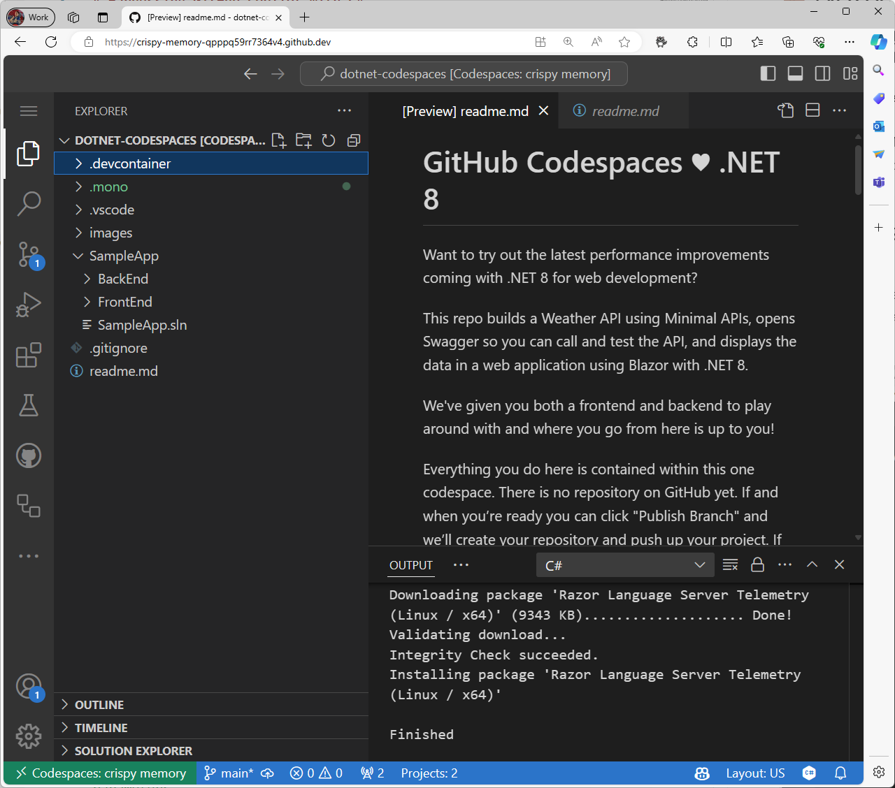
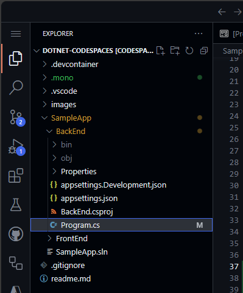

<header>

# 使用 GitHub Copilot 和 C#

GitHub Copilot 是全球第一个大规模 AI 开发者工具，通过在您工作时提供自动完成样式的建议，大大加快编写代码的速度。在本模块中，我们将重点介绍如何利用 GitHub Copilot 的强大功能来提高您的 C# 编码效率。

作为开发者，您的目标是提高生产力并加快编码过程。GitHub Copilot 就像您的 AI 配对程序员，根据上下文和代码模式提供建议。到本模块结束时，您不仅会知道如何在 Codespaces 中配置 GitHub Copilot，还会知道如何有效地生成和实施代码建议。

准备好进入一个实际场景！您将使用 GitHub Copilot 修改一个 C# 仓库来创建一个 API 端点。这个项目将为您提供开发一个提供 HTTP API 的 C# Web 应用程序的宝贵经验，该应用程序生成伪随机的天气预报信息。

</header>

- **适合于谁**：开发者，DevOps 工程师，软件开发经理，测试人员。
- **学习内容**：如何使用 GitHub Copilot 创建代码并为您的工作添加注释。
- **构建内容**：几个 C# 文件，其中的代码和注释建议将由 Copilot AI 生成。
- **先决条件**：要使用 GitHub Copilot，您必须拥有一个有效的 GitHub Copilot 订阅。注册 30 天免费 [Copilot](https://github.com/settings/copilot)。
- **时间**：本课程可以在一个小时内完成。

到本模块结束时，您将具备以下技能：

- 编写提示以生成来自 GitHub Copilot 的建议
- 应用 GitHub Copilot 来改进您的项目

## 先修阅读：
- [GitHub Copilot 的提示工程介绍](https://learn.microsoft.com/training/modules/introduction-prompt-engineering-with-github-copilot?WT.mc_id=academic-113596-abartolo)

- [什么是 Visual Studio 的 GitHub Copilot 扩展？](https://learn.microsoft.com/en-us/visualstudio/ide/visual-studio-github-copilot-extension?view=vs-2022&WT.mc_id=academic-113596-abartolo)

## 要求

1. 启用您的 [GitHub Copilot 服务](https://github.com/github-copilot/signup)

1. 熟悉 [此包含 Codespaces 的仓库](https://github.com/github/dotnet-codespaces)

## 💪🏽 练习

**右键单击以下 Codespaces 按钮，以在新选项卡中打开您的 Codespace**
 
[](https://codespaces.new/github/dotnet-codespaces)

"**GitHub Codespaces ♥️ .NET 8**" 仓库使用最小 API 构建一个天气 API，打开 Swagger 以便您可以调用和测试 API，并使用 .NET 8 在 Blazor 中显示数据的 Web 应用程序。

我们将回顾通过添加一个新的端点来更新 Weather BackEnd App 的步骤，该端点请求特定位置并返回该位置的天气预报。

### 🗒️（可选步骤 1）：熟悉“GitHub Codespaces ♥️ .NET 8” 仓库

当您在 Codespaces 中打开仓库时，您会发现一个全功能的 Codespace 新浏览器窗口。此仓库中的所有内容都包含在此 Codespace 中。例如，在资源管理器面板中，我们可以看到 BackEnd 和 FrontEnd 项目的主要代码。



要运行 BackEnd 项目，请转到"运行和调试"面板，并选择"BackEnd"项目。


启动所选项目的调试。天气 API 项目，即我们的 BackEnd 项目现在将在端口 8080 上运行。我们可以从*端口*面板复制发布的 URL。


BackEnd 应用程序发布了一个名为 `weatherforecast` 的端点，该端点生成随机的天气预报数据。要测试当前运行的应用程序，您可以将 `/weatherforecast` 添加到发布的 URL。最终的 URL 应类似于以下内容。

```bash
https://< 你的 url>.app.github.dev/weatherforecast
```
在浏览器中运行的应用程序应类似于这样。


现在让我们在应用程序中添加一个断点，以调试对 API 的每次调用。转到 BackEnd 项目中的 `Program.cs` 文件。文件路径为 `SampleApp\BackEnd\Program.cs`。

在第 24 行添加一个断点（按 F9）并刷新浏览器以测试端点的 URL。浏览器不应显示天气预报，在 Visual Studio 编辑器中，我们可以看到程序执行在第 24 行暂停。


按 F10 我们可以逐步调试到第 32 行，在那里我们可以看到生成的值。应用程序应该已经为接下来的 5 天生成了示例天气值。变量 `forecast` 包含一个数组，该数组包含这些值。


现在可以停止调试了。

恭喜！现在您已准备好使用 GitHub Copilot 向应用程序添加更多功能。

### 🗒️（可选步骤 2）：熟悉 GitHub Copilot Slash Commands

在我们的代码库中开始工作时，通常需要重构一些代码，或获取更多上下文或解释。使用 GitHub Copilot Chat，我们可以进行 AI 驱动的对话来执行这些任务。

打开 BackEnd 项目中的 `Program.cs` 文件。文件路径为 `SampleApp\BackEnd\Program.cs`。

现在让我们使用 GitHub Copilot 中的斜杠命令来理解一段代码。选择第 22-35 行，按 `CTRL + I` 打开内联聊天，并输入 `/explain`。


在聊天面板中，GitHub Copilot 会创建选定代码的详细解释。总结版本如下：

```
选中的 C# 代码是使用最小 API 特性的 ASP.NET Core 应用程序的一部分。它在 "/weatherforecast" 处定义了一个 GET 端点，该端点生成一组 WeatherForecast 对象。每个对象都由日期、随机温度和随机摘要创建。端点命名为 "GetWeatherForecast"，并具有 OpenAPI 支持，用于标准化 API 结构文档。
```

**斜杠命令** 是您可以在聊天中使用的特殊命令，以执行特定代码操作。例如，您可以使用：
- `/doc` 添加文档注释
- `/explain` 解释代码
- `/fix` 提议修复所选代码中的问题
- `/generate` 生成回答您问题的代码

让我们使用 `/tests` 命令生成代码的测试。选择第 39-42 行，按 `CTRL + I` 打开内联聊天，并输入 `/tests`（或选择 /tests 斜杠命令），以生成此记录的一组新测试。


此时，GitHub Copilot 将建议一个新类。您需要首先按 [Create] 来创建新文件。

一个名为 `ProgramTests.cs` 的新类已创建并添加到项目中。这些测试使用 XUnit，但是，您可以要求使用另一个单元测试库生成测试，命令如下：`/tests use MSTests for unit testing`。

***重要提示：**我们不会在此项目中使用测试文件。要继续，请删除生成的测试文件。*

最后，让我们使用 `/doc` 来生成代码的自动文档。选择第 39-42 行，按 `CTRL + I` 打开内联聊天，并输入 `/doc`（或选择该命令），以生成此记录的文档。


内联聊天、聊天面板和斜杠命令是支持使用 GitHub Copilot 开发体验的出色工具。现在我们准备为此应用程序添加新功能。

### 🗒️步骤 1：生成包含城市名称的新记录

转到 BackEnd 项目中的 `Program.cs` 文件。文件路径为 `SampleApp\BackEnd\Program.cs`。



导航到文件末尾，并要求 Copilot 生成一个包含城市名称的新记录。

```csharp
// 创建一个名为 WeatherForecastByCity 的内部记录，请求以下参数：City，Date，TemperatureC，Summary
```

生成的代码应类似于以下内容：

```csharp
// 创建一个名为 WeatherForecastByCity 的内部记录，请求以下参数：City，Date，TemperatureC，Summary
internal record WeatherForecastByCity(string City, DateOnly Date, int TemperatureC, string? Summary)
{
    public int TemperatureF => 32 + (int)(TemperatureC / 0.5556);
}
```

您可以查看下面的动画了解提示如何工作：


### 🔎步骤 2：生成一个新端点以获取城市的天气预报

现在让我们生成一个类似于 `/weatherforecast` 并包含城市名称的新 API 端点。新 API 端点名称为 **`/weatherforecastbycity`**。

***重要提示：**您必须在 '.WithOpenApi();' 行之后放置代码，这开始于第 36 行。此外，请记住每次新建议的一行时按 TAB，直到整个端点定义完毕。*

接下来，通过添加注释使用 GitHub Copilot 生成新端点： 

```csharp
// 创建一个名为 /WeatherForecastByCity/{city} 的新端点，在 url 中接受一个城市名称作为参数，并生成该城市的随机预报
```
在以下示例中，我们在上一个端点之后添加了一些额外的空行，然后 GitHub Copilot 生成了新的端点。一旦端点核心代码生成，GitHub Copilot 还会建议端点名称的代码（第 49 行）和 OpenAPI 规范（第 50 行）。记住按 [TAB] 接受每个建议。


***重要提示**：此提示生成了多行 C# 代码。强烈建议检查并审查生成的代码，以确保其按预期工作。*

生成的代码应类似于以下内容：

```csharp
// 创建一个名为 /WeatherForecastByCity/{city} 的新端点，在 url 中接受一个城市名称作为参数，并生成该城市的随机预报
app.MapGet("/WeatherForecastByCity/{city}", (string city) =>
{
    var forecast = new WeatherForecastByCity
    (
        city,
        DateOnly.FromDateTime(DateTime.Now),
        Random.Shared.Next(-20, 55),
        summaries[Random.Shared.Next(summaries.Length)]
    );
    return forecast;
})
.WithName("GetWeatherForecastByCity")
.WithOpenApi();
```

### 🐍步骤 3：测试新端点。

最后，通过运行和调试面板启动项目以验证新端点是否工作。选择运行和调试，然后选择 BackEnd 项目。


现在按运行，项目应构建并运行。项目运行后，我们可以使用您的 Codespace url 测试原始端点：

```bash
https://< 你的代码空间 url >.app.github.dev/WeatherForecast
```

新端点也可以进行测试。以下是一些使用不同城市的 url 示例：
```bash
https://< 你的代码空间 url >.app.github.dev/WeatherForecastByCity/Toronto

https://< 你的代码空间 url >.app.github.dev/WeatherForecastByCity/Madrid

https://< 你的代码空间 url >.app.github.dev/WeatherForecastByCity/<任何城市名称>
```

两次测试运行应类似于以下内容：


🚀 恭喜，通过练习，您不仅使用 GitHub Copilot 生成代码，还以一种互动和有趣的方式进行！您可以使用 GitHub Copilot 不仅仅生成代码，还可以编写文档、测试应用程序等。

## 法律声明

Microsoft 和任何贡献者根据 [Creative Commons Attribution 4.0 International Public License](https://creativecommons.org/licenses/by/4.0/legalcode) 授予您使用此平台上 Microsoft 文档和其他内容的许可，参见 [LICENSE](LICENSE) 文件，并根据 [MIT License](https://opensource.org/licenses/MIT) 授予您使用此平台上任何代码的许可，参见 [LICENSE-CODE](LICENSE-CODE) 文件。

Microsoft、Windows、Microsoft Azure 和/或文档中引用的其他 Microsoft 产品和服务可能是美国和/或其他国家的 Microsoft 商标或注册商标。本项目的许可不授予您使用任何 Microsoft 名称、徽标或商标的权利。Microsoft 的一般商标指南可在 http://go.microsoft.com/fwlink/?LinkID=254653 上找到。

隐私信息可在 https://privacy.microsoft.com/en-us/ 上找到。

Microsoft 和任何贡献者保留所有其他权利，无论是根据其各自的版权、专利或商标，是否通过暗示、不容争辩或其他方式。